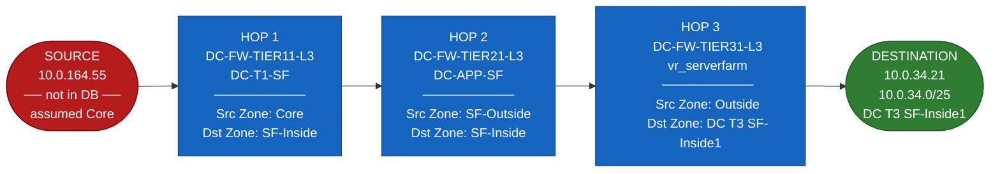

# Firewall Topology — Visual Map

> Open this file in VS Code and press `Ctrl+Shift+V` (Markdown Preview) to render the diagrams.
> Requires the **Markdown Preview Mermaid Support** extension if not already installed.

---

## 1. Full Topology Graph

All nodes = one Firewall + one VSys.
All connections are **bidirectional** (traffic can flow either direction).
Labels on each line show the gate names used at each end of the link.

```mermaid
flowchart TB
    classDef tier3  fill:#1565c0,stroke:#0d47a1,color:#fff
    classDef tier2  fill:#2e7d32,stroke:#1b5e20,color:#fff
    classDef tier1  fill:#c45e00,stroke:#8d3d00,color:#fff
    classDef edge   fill:#6a1b9a,stroke:#4a148c,color:#fff
    classDef core   fill:#b71c1c,stroke:#7f0000,color:#fff,stroke-width:3px

    OTHER(["OTHER / unconfigured
    ─────────────────
    gates: Core · Internet
    ── hidden from output ──"]):::core

    subgraph TIER3["  TIER 3  —  Server Segments  "]
        direction LR
        T31_SF["DC-FW-TIER31-L3
        vr_serverfarm"]:::tier3
        T31_DEV["DC-FW-TIER31-L3
        vr_development"]:::tier3
        T31_SW["DC-FW-TIER31-L3
        vr_switching"]:::tier3
        T31_ECOM["DC-FW-TIER31-L3
        vr_ecommerce"]:::tier3
    end

    subgraph TIER2["  TIER 2  —  Application Layer  "]
        direction LR
        T21_SF["DC-FW-TIER21-L3
        DC-APP-SF"]:::tier2
        T21_DEV["DC-FW-TIER21-L3
        DC-APP-DEV"]:::tier2
        T21_SW["DC-FW-TIER21-L3
        DC-APP-SW"]:::tier2
        T21_ECOM["DC-FW-TIER21-L3
        DC-APP-ECOM"]:::tier2
    end

    subgraph TIER1["  TIER 1  —  Perimeter  "]
        direction LR
        T11_SF["DC-FW-TIER11-L3
        DC-T1-SF"]:::tier1
        T11_DEV["DC-FW-TIER11-L3
        DC-T1-DEV"]:::tier1
        T11_ECOM_OUT["DC-FW-TIER11-L3
        ECOM-Outside"]:::tier1
        ECOM11["DC-FW-ECOM11-L3
        DC-T1-ECOM"]:::tier1
        SW11["DC-FW-SWITCHING11-L3
        DC-T1-SW"]:::tier1
    end

    subgraph EDGEFWS["  Edge / Specialty Firewalls  "]
        direction LR
        MGMNT["DC-FW-MGMNT11-L3
        Management OOB"]:::edge
        INTCONN["DC-FW-INTCONNECT11-L3
        Interconnect"]:::edge
        EXT_INET["DC-FW-EXT-INT2-L3
        INET"]:::edge
        EXT["DC-FW-EXT-INT2-L3
        EXT"]:::edge
        EXT2["DC-FW-EXT-INT2-L3
        EXT 2"]:::edge
        VPN["DC-FW-VPN2
        VPN"]:::edge
    end

    %% ── Tier 3 ↔ Tier 2 ──────────────────────────────────────────
    T31_SF ---|Outside <-> SF-Inside| T21_SF
    T31_DEV ---|Outside <-> DEV-Inside| T21_DEV
    T31_SW ---|Outside <-> SW-Inside| T21_SW
    T31_ECOM ---|Outside <-> ECOM-Inside| T21_ECOM

    %% ── Tier 2 ↔ Tier 1 / Dedicated edge firewalls ───────────────
    T21_SF ---|SF-Outside <-> SF-Inside| T11_SF
    T21_DEV ---|DEV-Outside <-> DEV-Inside| T11_DEV
    T21_SW ---|SW-Outside <-> SW-Inside| SW11
    T21_ECOM ---|ECOM-Outside <-> ECOM-Inside| ECOM11

    %% ── Tier 1 ↔ Core/Internet ────────────────────────────────────
    T11_SF ---|SF-Outside <-> Core| OTHER
    T11_DEV ---|DEV-Outside <-> Core| OTHER
    T11_ECOM_OUT ---|Internet <-> Internet| OTHER
    T11_ECOM_OUT ---|Internal <-> Core| OTHER
    ECOM11 ---|ECOM-Outside <-> Core| OTHER
    SW11 ---|SW-Outside <-> Core| OTHER

    %% ── Edge Firewalls ↔ Core/Internet ────────────────────────────
    MGMNT ---|Outside <-> Core| OTHER
    INTCONN ---|WAN Outside <-> Core| OTHER
    EXT_INET ---|rn internal <-> Core| OTHER
    EXT_INET ---|dc_prisma_rn_internet <-> Internet| OTHER
    EXT ---|inside <-> Core| OTHER
    EXT2 ---|inside <-> Core| OTHER
    VPN ---|dc_vpn_s2s <-> Core| OTHER
```

---

## 2. BFS Tree — Rooted at `other/unconfigured`

This shows the order BFS discovers nodes starting from `other/unconfigured`.
The depth (level) of each node = the **minimum number of firewall hops** needed to reach it from Core/Internet.

```mermaid
flowchart TD
    classDef tier3  fill:#1565c0,stroke:#0d47a1,color:#fff
    classDef tier2  fill:#2e7d32,stroke:#1b5e20,color:#fff
    classDef tier1  fill:#c45e00,stroke:#8d3d00,color:#fff
    classDef edge   fill:#6a1b9a,stroke:#4a148c,color:#fff
    classDef core   fill:#b71c1c,stroke:#7f0000,color:#fff,stroke-width:3px

    ROOT(["other/unconfigured
    ── LEVEL 0 ──"]):::core

    %% ── Level 1: directly connected to Core/Internet ─────────────
    ROOT -->|Core -> SF-Outside| L1_T11_SF["DC-FW-TIER11-L3
    DC-T1-SF"]:::tier1
    ROOT -->|Core -> DEV-Outside| L1_T11_DEV["DC-FW-TIER11-L3
    DC-T1-DEV"]:::tier1
    ROOT -->|Internet -> Internet| L1_T11_ECOM["DC-FW-TIER11-L3
    ECOM-Outside"]:::tier1
    ROOT -->|Core -> ECOM-Outside| L1_ECOM11["DC-FW-ECOM11-L3
    DC-T1-ECOM"]:::tier1
    ROOT -->|Core -> SW-Outside| L1_SW11["DC-FW-SWITCHING11-L3
    DC-T1-SW"]:::tier1
    ROOT -->|Core -> Outside| L1_MGMNT["DC-FW-MGMNT11-L3
    Management OOB"]:::edge
    ROOT -->|Core -> WAN Outside| L1_INTCONN["DC-FW-INTCONNECT11-L3
    Interconnect"]:::edge
    ROOT -->|Core -> rn internal| L1_EXT_INET["DC-FW-EXT-INT2-L3
    INET"]:::edge
    ROOT -->|Core -> inside| L1_EXT["DC-FW-EXT-INT2-L3
    EXT"]:::edge
    ROOT -->|Core -> inside| L1_EXT2["DC-FW-EXT-INT2-L3
    EXT 2"]:::edge
    ROOT -->|Core -> dc_vpn_s2s| L1_VPN["DC-FW-VPN2
    VPN"]:::edge

    %% ── Level 2: reachable via Level 1 ───────────────────────────
    L1_T11_SF -->|SF-Inside -> SF-Outside| L2_T21_SF["DC-FW-TIER21-L3
    DC-APP-SF"]:::tier2
    L1_T11_DEV -->|DEV-Inside -> DEV-Outside| L2_T21_DEV["DC-FW-TIER21-L3
    DC-APP-DEV"]:::tier2
    L1_ECOM11 -->|ECOM-Inside -> ECOM-Outside| L2_T21_ECOM["DC-FW-TIER21-L3
    DC-APP-ECOM"]:::tier2
    L1_SW11 -->|SW-Inside -> SW-Outside| L2_T21_SW["DC-FW-TIER21-L3
    DC-APP-SW"]:::tier2

    %% ── Level 3: reachable via Level 2 ───────────────────────────
    L2_T21_SF -->|SF-Inside -> Outside| L3_T31_SF["DC-FW-TIER31-L3
    vr_serverfarm"]:::tier3
    L2_T21_DEV -->|DEV-Inside -> Outside| L3_T31_DEV["DC-FW-TIER31-L3
    vr_development"]:::tier3
    L2_T21_ECOM -->|ECOM-Inside -> Outside| L3_T31_ECOM["DC-FW-TIER31-L3
    vr_ecommerce"]:::tier3
    L2_T21_SW -->|SW-Inside -> Outside| L3_T31_SW["DC-FW-TIER31-L3
    vr_switching"]:::tier3
```

**Reading this tree:**
- A node at **Level 1** = 1 firewall hop from Core/Internet
- A node at **Level 2** = 2 hops (must pass through a Tier 1 firewall first)
- A node at **Level 3** = 3 hops (must pass through Tier 1 → Tier 2 first)

---

## 3. Example Path Walkthrough

### Case: `10.0.164.55` → `10.0.34.21` (service: 22)

| Step | What happens |
|------|-------------|
| **1. Lookup source** | `10.0.164.55` — not in cidr_db.csv, private IP → fallback to `other/unconfigured`, zone = `Core` |
| **2. Lookup destination** | `10.0.34.21` — found in `10.0.34.0/25` → `DC-FW-TIER31-L3 / vr_serverfarm`, zone = `DC T3 SF-Inside1` |
| **3. BFS path** | `other/unconfigured` → `DC-FW-TIER11-L3/DC-T1-SF` → `DC-FW-TIER21-L3/DC-APP-SF` → `DC-FW-TIER31-L3/vr_serverfarm` |
| **4. Output rows** | 3 rows (one per hop) |

---

## 4. Node & Segment Reference

### Which IP segments sit behind each firewall node?

| Firewall | VSys | Zone | Segment examples |
|---|---|---|---|
| DC-FW-TIER31-L3 | vr_serverfarm | DC T3 SF-Inside1 | 10.0.33.0/25, 10.0.34.0/25 |
| DC-FW-TIER31-L3 | vr_serverfarm | DC T3 SF-InsideCICD | 10.0.36.0/24, 10.0.37.0/24 |
| DC-FW-TIER31-L3 | vr_switching | DC T3 SW-Inside | 10.0.4.128/25, ... |
| DC-FW-TIER31-L3 | vr_ecommerce | DC T3 ECOM-Inside | 10.0.96.x, 10.0.97.x, ... |
| DC-FW-TIER31-L3 | vr_development | DC T3 DEV-Inside | 10.0.107.x, 10.0.113.x, ... |
| DC-FW-ECOM11-L3 | DC-T1-ECOM | DC ECOM T1 ECOM-DMZ | 10.0.96.0/27, 10.0.64.0/25, ... |
| DC-FW-SWITCHING11-L3 | DC-T1-SW | DC SW T1 SW-DMZ | 10.0.4.0/25, 10.0.5.0/28, ... |
| DC-FW-TIER11-L3 | DC-T1-SF | DC T1 SF-DMZ | 10.0.0.0/25, 10.0.1.0/25, ... |
| DC-FW-TIER11-L3 | DC-T1-DEV | DC T1 DEV-DMZ | 10.0.107.0/25, 10.0.116.x, ... |
| DC-FW-MGMNT11-L3 | Management OOB | SF-MGMTCICD / MGMTSVR* | 10.0.109.0/24, 10.0.120.x, ... |
| other/unconfigured | — | Core | Any private IP not in DB |
| other/unconfigured | — | Internet | Any public IP not in DB |

> For the full and authoritative list, see `reference/cidr_db.csv`.
